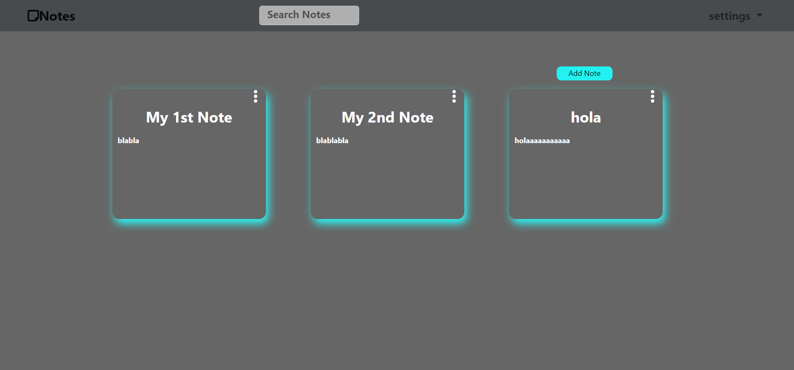

# Notes-Site-API
##Angular crud project using api
### i made this project using APIs to post and get data, also used angular forms for authentication,
### forms validation, subjects, behavior subjects and so on

